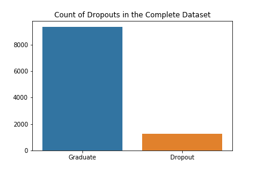
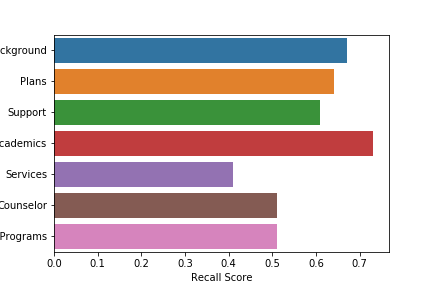

# HS Counsel Tool

## The Problem

The goal of this analysis is to build a model that will flag students that are at risk of dropping out of High School so that proper resources can be provided for them. As a tool, such a model could be utilized by high school counselors seeking to understand how to best budget their limited resources.

 

## The Data

The data used for this analysis was collected by NCES for the High School Longitudinal Study of 2009, a Nationally representative, longitudinal study of 23,000+ 9th graders from 944 schools in 2009, with a first follow-up in 2012 and a second follow-up in 2016. Complete information on the dataset can be found at https://nces.ed.gov/surveys/hsls09/. 

The data contains over 8000 variables. For the purposes of this analysis I condensed and consolidated the data points into 16 categories and composites of the more granular original dataset. After cleaning and formatting the data there were 64 variables with 10532 entries collected from the base year of the study, when the students were in 9th grade.

## Analysis

The model was able to predict 73% of dropouts with a precision of 30%. Although this precision is not ideal, in light of the problem, which seeks to provide services for students in need of additional support a high recall rate is the priority.

In addition, I modeled each category separately to determine which types of information would be most useful for making judgements in the future. 

I found that Academic achievement was nearly as predictive as the full model. I reccomend using academic achievement as a metric of success for some of the other categories, which were not as predictive when it comes to student dropouts.